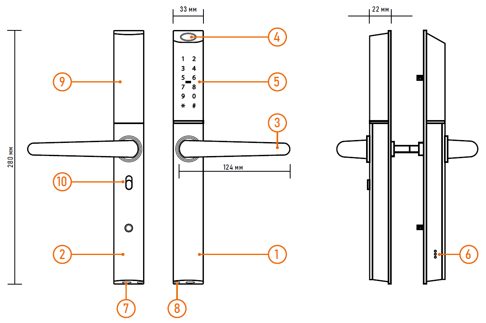
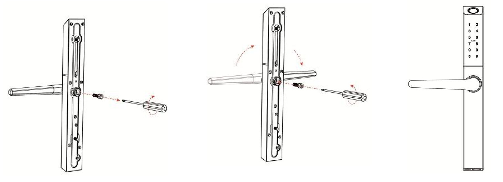
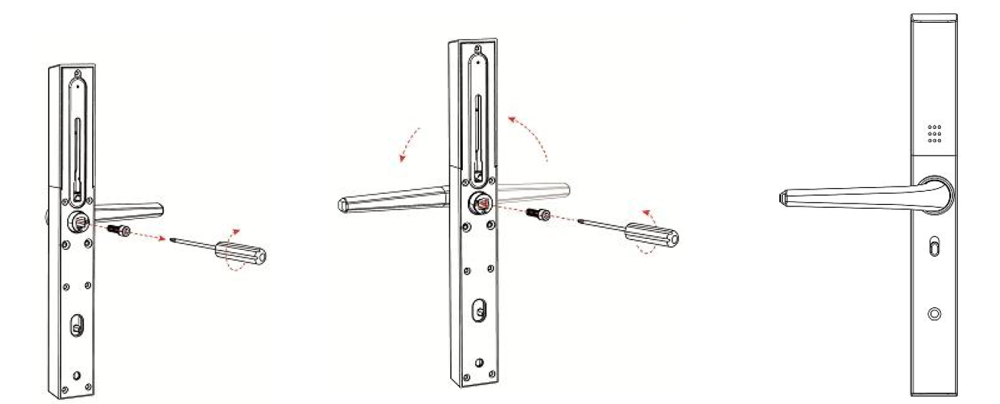
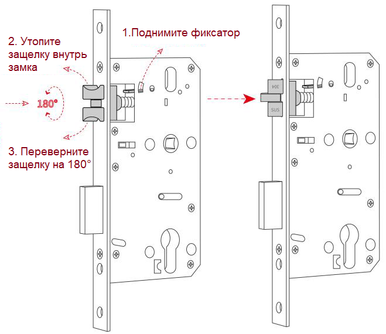
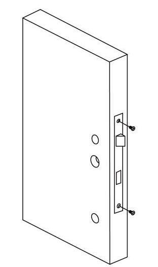
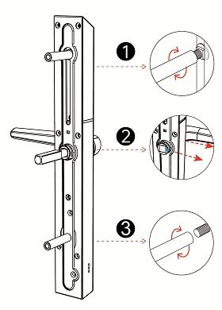
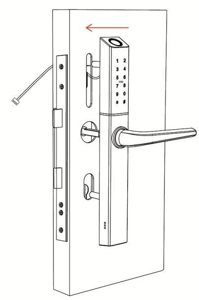
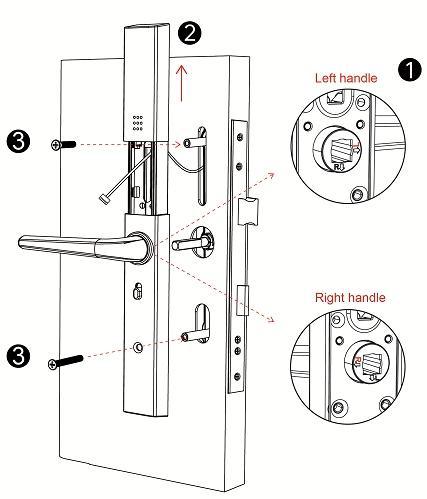
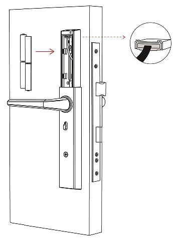
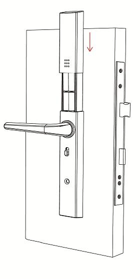

## ВВЕДЕНИЕ

:::tip 

**УВАЖАЕМЫЙ ПОКУПАТЕЛЬ!**

Поздравляем Вас с покупкой! Мы делаем все возможное, чтобы наша продукция удовлетворяла Вашим запросам. Перед началом эксплуатации изделия внимательно ознакомьтесь с Руководством пользователя и с Условиями гарантийного обслуживания.

:::

### Торговые марки

Все торговые марки являются собственностью их законных владельцев.

### Авторское право

Данное Руководство и содержащаяся в нем информация защищены авторским правом. Все права защищены.

**ПРЕДУПРЕЖДЕНИЕ**

Пользователь ответственен за соблюдение всех положений действующего законодательства при использовании изделия. Novicam™ не несет никакой ответственности перед лицом или организацией за ущерб или повреждения произошедшие от информации, содержащейся в данном Руководстве, а также за нарушение требований закона и иных правовых актов в процессе эксплуатации изделия.

:::note Меры предосторожности

-  Прежде чем начать работу с устройством, внимательно ознакомьтесь с Руководством Пользователя.

-  Не разбирайте устройство, это может привести к его неправильному функционированию или поломке и сделает гарантию недействительной.

-  Все электрические контакты соединяйте в полном соответствии с бирками и инструкциями, указанными в данном Руководстве. В противном случае Вы можете нанести изделию непоправимый ущерб и, тем самым, также сделать гарантию недействительной.

-  Не эксплуатируйте устройство в условиях, если температура, показатели влажности и технические характеристики источника питания превышают установленные значения для данного прибора.

-  Не используйте для протирки изделия бензин, спирт или другие растворители, т.к. они могут повредить поверхность. Для чистки используйте мягкую сухую ткань.

:::

### Условия эксплуатации

Не располагайте устройство в местах попадания прямых солнечных лучей. В противном случае это может привести к повреждению устройства. Строго соблюдайте установленный для данного устройства температурный режим.

Не устанавливайте устройство:

-  в зонах с влажностью и уровнем загрязнения воздуха более 95%;

-  в области повышенного испарения и парообразования или усиленной вибрации.

Храните механические ключи от замка в доступном месте.

Предотвращайте механические повреждения устройства.

---

## ОПИСАНИЕ

[Электронный замок](https://novilock.ru/catalog/elektronnye-zamki-dlya-apartamentov/smart-shape-novilock-v-1012l-zamok-elektronnyy/) Smart Shape это универсальное решение, которое подойдет как для входных дверей с современным дизайном так и для узкопрофильных дверей в домах, офисах и магазинах. Для данной модели можно выбрать врезную часть под любую дверь с бэксетом от 28 до 65 мм.

Корпус накладной части и ручки выполнены из высококачественного алюминиевого сплава с основанием из нержавеющей стали, все элементы врезной части замка выполнены из стали марки SS304, что гарантирует надежность и долговечность.

Несмотря на узкий корпус, [смарт замок](https://novilock.ru/catalog/elektronnye-zamki-dlya-apartamentov/smart-shape-novilock-v-1012l-zamok-elektronnyy/) Smart Shape оснащен полным набором способов открытия - пароли, карты, отпечатки пальцев, электронные ключи TTLock eKeys и запасной металлический ключ.

Облачные сервисы TTLock и TTHotel обеспечат удобный контроль доступа в любом сценарии использования.

Все модели смарт замков можно посмотреть в [каталоге Novilock](https://novilock.ru/catalog/elektronnye-zamki-dlya-apartamentov/smart-shape-novilock-v-1012l-zamok-elektronnyy/).

{width=1216px height=807px}



---

*  

   **Описание**

---

*  

   1\. Передняя панель

*  

   6\. Встроенный динамик

---

*  

   2\. Задняя панель

*  

   7\. Отверстие для механического ключа

---

*  

   3\. Ручка

*  

   8\. Разъем для аварийного питания

---

*  

   4\. Сканер отпечатков

*  

   9\. отсек для батареек

---

*  

   5\. Клавиатура и считыватель карт

*  

   10\. Переключатель режима "не беспокоить"



:::info 

**ОБРАТИТЕ ВНИМАНИЕ**

1. Механические ключи храните в доступном месте, в т.ч. во время установки.

2. Заменяйте источники питания при достижении низкого уровня заряда.

3. Внимательно изучите данное Руководство перед установкой и сохраните его для дальнейшего использования.

:::

:::note 

### Напряжение питания

Используйте только рекомендованное напряжение питания. Перед включением оборудования убедитесь в том, что соединительные провода (разъемы) подключены с соблюдением полярности. Неверное соединение может привести к повреждению и/или неправильному функционированию устройства.

:::

### Спецификация



---

*  

   Модель

*  

   Smart Shape

---

*  

   Версия

*  

   1012L

---

*  

   Цвет

*  

   Чёрный

---

*  

   Класс защиты

*  

   Пылевлагозащита IP55

---

*  

   Материал замка

*  

   Алюминиевый сплав, ударопрочный пластик

---

*  

   Материал двери

*  

   Алюминий / Дерево / Пластик

---

*  

   Толщина двери

*  

   35 \~ 130 мм

---

*  

   Ресурс работы

*  

   250000 циклов

---

*  

   Монтаж

*  

   Накладной

---

*  

   **СЕТЬ И ПОДКЛЮЧЕНИЕ**

---

*  

   Приложение

*  

   TTLock / TTHotel

---

*  

   Беспроводной интерфейс

*  

   Bluetooth 5.0 LE

---

*  

   **ФИЗИЧЕСКИЕ ХАРАКТЕРИСТИКИ**

---

*  

   Рабочая температура

*  

   \-25°C…+60°C

---

*  

   Рабочая влажность

*  

   0\~95%

---

*  

   Габаритные размеры

*  

   Панель (ш×в×г)

*  

   33 ×280×22 мм

---

*  

   Ручка (д×в)

*  

   124×39 мм

---

*  

   Рабочее напряжение

*  

   6 В (4×AAA\*



### Комплектация



---

*  

   Передняя панель

*  

   1 шт

---

*  

   Задняя панель

*  

   1 шт

---

*  

   RF карты / брелки

*  

   3 шт

---

*  

   Уплотнительная резиновая пластина

*  

   2 шт

---

*  

   Стяжки

*  

   

---

*  

   Винты

*  

   

---

*  

   Квадратный вал

*  

   

---

*  

   Механический ключ

*  

   2 шт

---

*  

   Технический паспорт изделия

*  

   1 шт



## УСТАНОВКА И ПОДКЛЮЧЕНИЕ

1. Перед установкой проверьте комплектацию. Она должна соответствовать заявленной в Паспорте изделия.

2. Осмотрите устройство перед использованием. Извлеките из упаковки и проверьте на предмет повреждений, которые могли произойти во время транспортировки.

3. При обнаружении каких-либо несоответствий в комплектации или повреждений, обратитесь к производителю или дистрибьютору для замены устройства.

4. В случае неисправности не осуществляйте самостоятельный ремонт устройства.

5. Убедитесь, что габариты и другие параметры двери соответствуют техническим характеристикам устройства.

### Направление открывания двери

:::info 

Отрегулируйте ручку и защелку в соответствии с направлением, в котором открывается дверь

:::

#### Внешняя накладная часть замка

{width=1459px height=531px}

1. Ослабьте внутренний шестигранный винт ручки замка

2. Переверните ручку в нужно положение

3. Затяните винт для фиксации ручки в нужном положении

#### Внутренняя накладная часть замка

{width=1355px height=548px}

1. Ослабьте внутренний шестигранный винт ручки замка

2. Переверните ручку в нужно положение

3. Затяните винт для фиксации ручки в нужном положении

#### Врезная часть замка

{width=659px height=570px}

1. Поднимите фиксатор защелки

2. Утопите защелку внутрь замка

3. Переверните защелку на 180**°**

4. Верните защелку в нормальное положение и опустите фиксатор

### Врезка замка

В случае, если вы устанавливаете электронный замок в неподготовленную дверь или меняете старый замок, то потребуется доработка дверного полотна. Для этого можно воспользоваться шаблоном врезки для конкретной версии накладной и врезной части. Пожалуйста, убедитесь что используете нужны шаблон врезки, соответствующий вашему оборудованию.

### Установка замка

Шаг 1. Установка врезной части

{width=312px height=526px}

{width=280px height=390px}

{width=402px height=606px}

{width=427px height=499px}

{width=347px height=475px}

{width=280px height=559px}