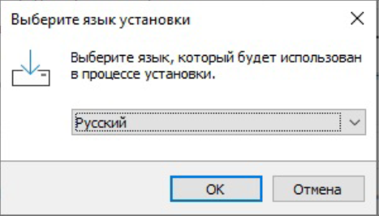
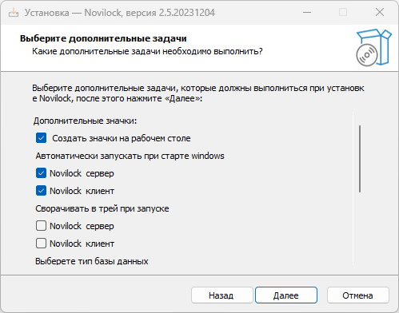
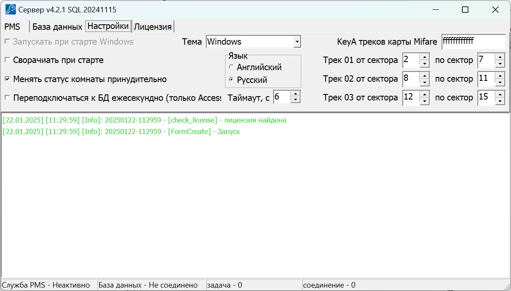
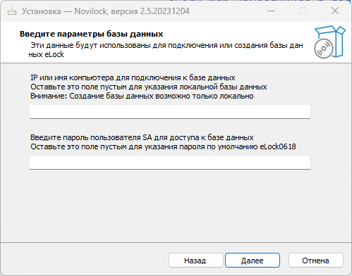
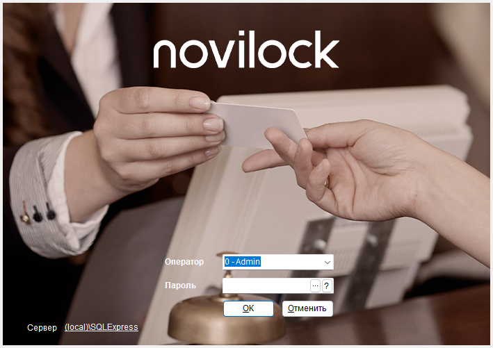
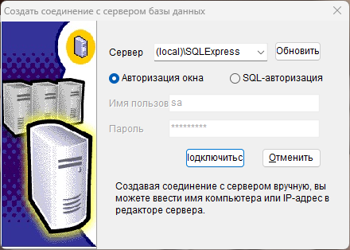
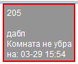

# Установка системы

\[TOC\]

## Установка iLMS

Рекомендуется делать полную установку ПО ILMS Novilock с установкой Microsoft SQL Server 2014, Server и Client. Для установки ПО перегрузите ваш компьютер под учетной записью с правами администратора и запустите предоставленный вам файл setup.exe. Если административных прав хватает, то откроется окно выбора языка.

Выбор языка влияет на установку всех компонентов. Выберете язык и нажмите кнопку `OK`

&nbsp;

&nbsp;

&nbsp;

&nbsp;

При необходимость можно сделать выборочную установку установив соответствующие галочки при установке.

&nbsp;

&nbsp;

&nbsp;

&nbsp;

!!! note "Внимание" Выбор компонента ILMS обязателен, так как именно в этом компоненте находиться база данных eLock.mdb с которой работают все компоненты. Для подключения к базе данных используется пароль eLock0618

Нажмите `Далее` для продолжения установки.

&nbsp;

&nbsp;

&nbsp;

&nbsp;

Выберите дополнительные задачи и настройки.

* **Создать значки на рабочем столе**. Параметр определяет будут ли созданы значки Server, Client и ILMS на рабочем столе. Если снять, то значки созданы не будут.

!!! warning inline end "В дальнейшем невозможно изменить эту настройку без переустановки компонента или ручной правки реестра. "

* **Автоматически запускать при старте windows**. Параметр отвечает за автоматический старт компонента ПО при загрузке windows.
* **Сворачивать в трей при запуске**. Если параметр установлен, то программа будет сворачиваться в трей при запуске. В дальнейшем можно изменить в настройках.

  

* **Выберите тип базы данных**. Для данного типа установки необходимо выбрать Access (локальное использование на одном компьютере) Этот параметр влияет на настройки по умолчанию для всех трех компонентов.

!!! null "База данных Access"

    При настройке ПО в локальном режиме вместо Microsoft SQL Server есть возможность использовать базу данных Access. Наше ПО может работать с данной базой данных, но мы крайне не рекомендуем этого делать из-за её ограниченности. В частности, из-за ограничений длинны полей могут возникать ошибки при обработке длинных команд. Так же происходят задержки до 10 секунд при передаче данных клиенту. Мы попытались обойти эти ограничения, но всё же не рекомендуем использовать данный тип базы данных. Предпочтительно использовать Microsoft SQL Server.

* **Настроить подключение к этому компьютеру с параметрами по умолчанию**. Если данный параметр установлен, то будет произведен сброс настроек соединения и установка их в значения по умолчанию. Соответственно при выборе типа базы данных Access, в качестве файла БД будет указан файл eLock.mdb находящийся в папке ILMS. Примечание: если какой-либо из компонентов настроен и работает, то возможно и нет необходимости сбрасывать его настройки установкой данного параметра.

* **IP или имя компьютера**. При установке на сервер или ПК, который будет использоваться в качестве основного (хранить базу данных), оставьте это поле пустым. При установке на дополнительные рабочие места укажите адрес сервера.
* **Пароль пользователя SA для доступа к базе данных**. Рекомендуется задать собственный пароль для доступа к БД. По умолчанию пароль eLock0618.

  

Проверьте правильность выбранных параметров установки и нажмите  `Установить`

Будет произведена распаковка компонентов и их настройка для работы с базой данных. По завершении будет предложено перезагрузить компьютер.

Если все было сделано правильно, то после перезагрузки должны будут автоматически запуститься клиент и сервер(если была указана функция автозапуска) В логах должны быть записи об успешном подключении к БД и создании операционных таблиц.

Теперь необходимо запустить ILMS, настроить номерной фонд, проверить работу с энкодером и настроить PMS для взаимодействия компонентом server.

## Запуск iLMS

Запустите программу iLMS ярлыком на рабочем столе либо через поиск по названию Novilock Intelligent Lock Management System

Выберите пункт "Авторизация окна" при использовании локальной базы данных SQL Express

!!! bug "Отсутствие доступа к БД SQL после установки"

    В некоторых случаях установка SQL Server Express может происходить некорректно, что мешает запуску iLMS после установки. Для устранения проблемы необходимо переустановить SQL Server Express отдельно.
    ??? note "Установка SQL Server Express"

         ***Этап 1***. Скачайте дистрибутив Microsoft SQL Server 2014 Express для Вашей системы с официального сайта Microsoft ***[www.microsoft.com/ru-ru/download/details.aspx?id=42299](https://www.microsoft.com/ru-ru/download/details.aspx?id=42299)***

    	Для большинства ПК используется версия Express 64BIT (SQLEXPR_x64_RUS.exe)

         ***Этап 2***. Запустите этот файл и следуйте инструкциям мастера установки. На странице выбора типа установки выберите добавление компонентов к существующему экземпляру SQL Server и укажите экземпляр, который требуется обновить.
         Примечание.При загрузке с помощью средства Microsoft Edge в Windows 10 может появиться диалоговое окно "Выбор каталога для извлекаемых файлов" с предлагаемым по умолчанию путем, включающим папку \System32\. В этом случае измените путь и укажите другое расположение на компьютере перед нажатием кнопки ОК.

         ***Этап 3***. На странице выбора компонентов установите флажок "Средства управления — полный набор" и продолжите установку.

         ***Примечание***. Microsoft® SQL Server® 2014 Express включает как 32-разрядную, так и 64-разрядную версии. SQLEXPR32_x86 представляет собой небольшой пакет, который может использоваться для установки SQL Server 2014 Express только в 32-разрядных операционных системах. SQLEXPR_x86 — это тот же продукт, но поддерживающий установку в 32-разрядных и в 64-разрядных (WoW) операционных системах. SQLEXPR_x64 — это 64-разрядная версия SQL Server 2014 Express, поддерживающая установку только в 64-разрядных операционных системах. Других различий между этими пакетами нет. Microsoft® SQL Server® 2014 Express не поддерживается в системах IA64.

### Подключение энкодера

Для запуска программы требуется подключить [энкодер](https://novilock.ru/index.php?route=product/product&amp;path=71_77&amp;product_id=108). Установка драйверов для его работы не требуется.

### Авторизация энкодера

При подключении нового энкодера требуется его активация с помощью карты авторизации.

---

## Настройка системы

Перейдите на главную страницу и нажмите **Настройка системы**

На вкладке **Основная настройка** доступны следующие пункты

**Название** **компании** - наименование компании или объекта

**Имя** **программы** - наименование, отображаемое в окне программы

**После выезда сменить статус** - время, на которое номеру присваивается статус **`Комната не убрана`**. По истечению этого времени номер переходит в свободный фонд автоматически. Установите значение на **0**, если использование этого статуса не требуется.

&nbsp;

??? null "asd test asd"

    asd asda adsdasdas d wegsdfg earg sdgerhd