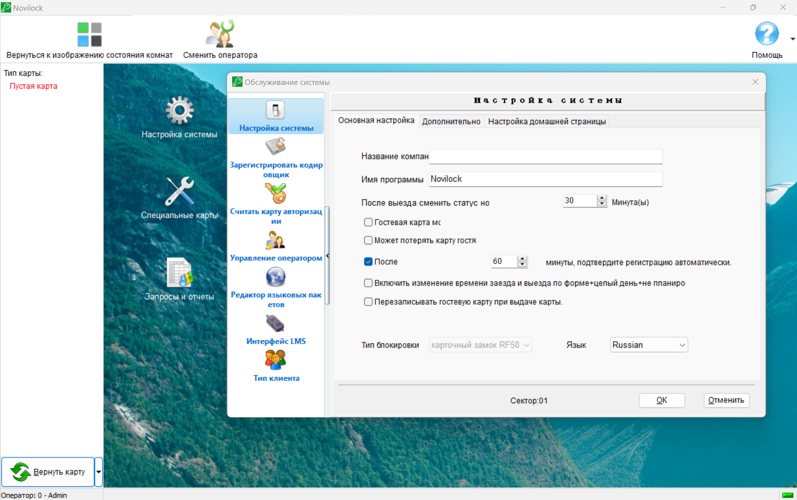
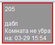

# Настройка системы и ПО ILMS

---

## Настройка системы

Перейдите на главную страницу и нажмите **Настройка системы**

На вкладке **Основная настройка** доступны следующие пункты

- **Название** **компании** - наименование компании или объекта

- **Имя** **программы** - наименование, отображаемое в окне программы

- **После выезда сменить статус** - время, на которое номеру присваивается статус **`Комната не убрана`**. По истечению этого времени номер переходит в свободный фонд автоматически. Установите значение на **0**, если использование этого статуса не требуется.

  

- **Гостевая карта может открывать семейный номер** - данная настройка не используется, так как логика работы семейных номеров задается в настройках PMS систем.

- 
