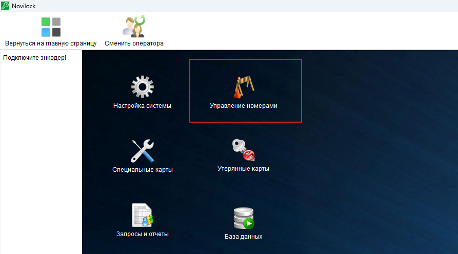
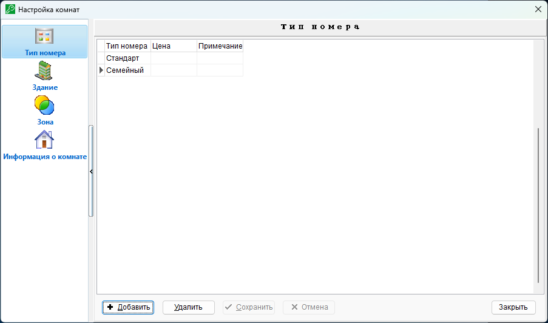
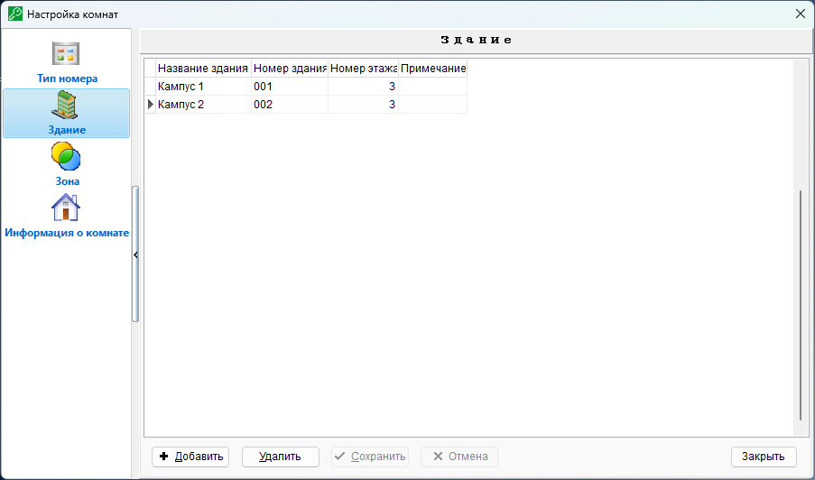
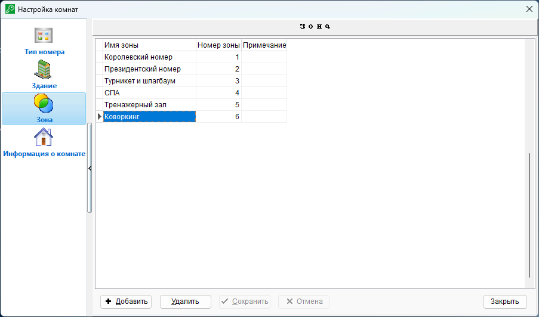
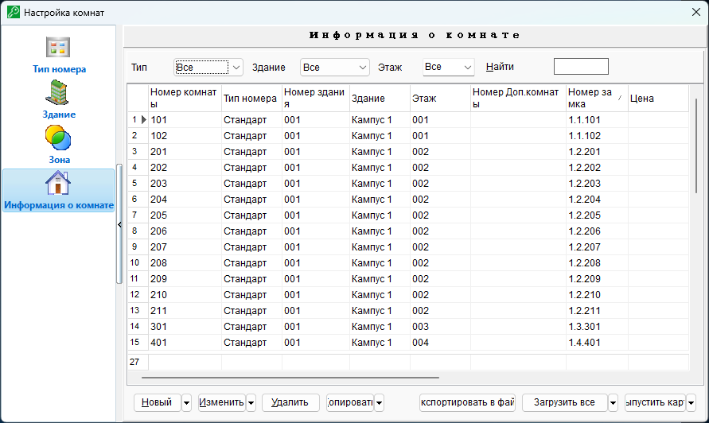
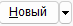
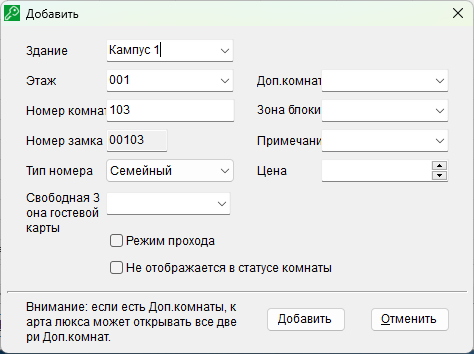
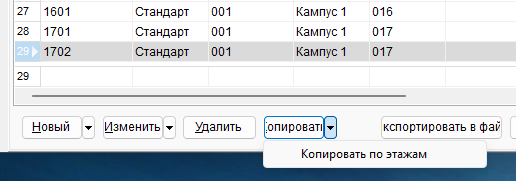
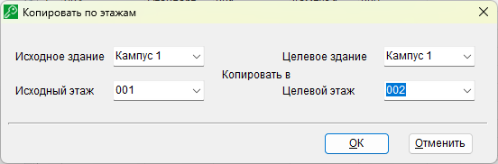
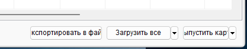

# Управление номерным фондом

[TOC]

------

## **Структура номерного фонда**

Каждый электронных замок в системе имеет свой уникальный номер вида 1.2.203 где 

первое значение (1) - номер здания

второе (2) - этаж

третье (203) - номер комнаты

Обычно номер комнаты начинается с этажа, например 203 - комната номер 3 на этаже номер 2. 

Так же в память замка записывается зона, в которой он находится. Зоны могут быть использованы для доступа гостя или персонала сразу к нескольким замкам. Например при объединении нескольких номеров в один либо при наличии общих зон, таких как СПА, раздевалки и др.

------

## **Интерфейс управления номерным фондом**

Для перехода к управлению номерным фондом откройте главное меню и выберите пункт "Управление номерами"

В открывшемся окне доступно 4 вкладки:

### 1) Тип номера

Тип номера обозначает основную особенность или отличие, например, стандарт или люкс.
Данная настройка не влияет на работу системы электронных замков и используется только для удобства просмотра номеров в шахматке iLMS.
При использовании интеграций с PMS системами тип номера настраивается непосредственно в PMS системе, в этом случае заполнение типов номеров в iLMS не требуется.

   

### 2) Здание

Для работы системы должен быть настроен минимум один тип здания, номер указывается системой в памяти замка. 

### 3) Зона

Каждому замку в системе может быть присвоен номер зоны, в которой он находится. это позволяет использовать замки не только на гостевых номерах, но и в помещениях с общим доступом или, например, объединять несколько номеров в один.

!!! note "Пример"

	Например, у Вас есть отдельные номер 518, 519 и 520. Но, при необходимости, они могут объединяться в один - Королевский.
	
	Для реализации данной схемы можно объединить их в одной зоне и настроить PMS систему так, что бы при выпуске виртуального Королевского номера на карту писался доступ к одному из них плюс соответствующая зона. Таким образом гость получит доступ ко всем номерам объединенного номера.
	
	При выпуске карт на каждый номер по отдельности эти зоны не будут задействован и доступа к другим номерам не будет.

На карту гостя может быть записан дополнительный доступ к его номеру и дополнительно до 5 зон, точное количество зависит от используемой PMS системы и возможности интеграции.

### 4) Информация о комнате

Здесь представлен основной интерфейс для создания и настройки номерного фонда.

------

#### Создание комнат

Для создания номеров нажмите кнопку 

Укажите **здание**, **этаж** и введите **номер комнаты**, например Кампус 1, этаж 1 и номер 103. Данная запись будет соответствовать замку 1.1.103

!!! note "Совет"
	Если PMS система была настроена раньше замковой системы iLMS то рекомендуется использовать нумерацию комнат в соответствии с существующими настройками!

- **Тип номера** настраивается при использовании iLMS в качестве основной программы, с PMS системами типы не взаимодействуют.

- **Свободная зона** указывает зону, доступ к которой будет дан гостям из этого номера. Используется только при выпуске карт из iLMS, обычно логика предоставления доступа к зонам настраивается в PMS системах.

- **Доп. комната** выбирается при наличии межкомнатных дверей, оснащенных электронным замком. 
- **Зона блокировки** - зона, в которой находится замок. При изменении этого параметра после запуска системы замок требуется перепрограммировать.

- **Примечание** - необязательный комментарий, указывающий особенности номера.

- Цена - стоимость проживания, используется только программой iLMS и не влияет на PMS системы или работу замков.

- **Режим прохода** - перевод замка в режим свободного прохода. В этом режиме замок не блокируется автоматически, карта доступа может открывать и закрывать такой замок вручную.

- **Не отображается в статусе комнаты** - скрывает комнату из шахматки iLMS, не влияет на работу PMS систем.

Для сохранения настроек комнаты нажмите **`Добавить`**

После добавления комнаты окно настроек не закрывается автоматически но в нем меняется номер на следующий по порядку, например, после добавления комнаты **103** номер автоматически изменится на **104** с сохранением прошлых настроек. Это позволяет быстро добавлять однотипные номера на одном этаже.

------

#### Копирование комнат по этажам

Для копирования номеров по этажам можно воспользоваться соответствующей функцией. Для этого вернитесь к основному окну настроек комнат, нажмите на выпадающее меню кнопки **`Копировать`** и выберите пункт **`Копировать по этажам`**

В открывшемся новом окне копирования выберите исходное и целевое здание и этаж, затем нажмите **`OK`**

!!! bug "Доступны не все этажи"
	В случае, если в данном окне не отображаются нужные этажи, проверьте указанное количество этажей в пункте настроек "**Здание**"

------

#### Синхронизация конфигурации с программатором и выпуск карт настройки замков

**Экспорт в файл** - сохранение списка номеров в файл с указанием внутренней нумерации замков.

**Загрузить все** и **Загрузить выбранное** - загрузка конфигурации в ручной программатор HandSet для последующей настройки замков.

**Выпустить карту** - создание карты для настройки замка. При отсутствии ручного программатора HandSet требуется выпуск карт под каждый замок отдельно.
