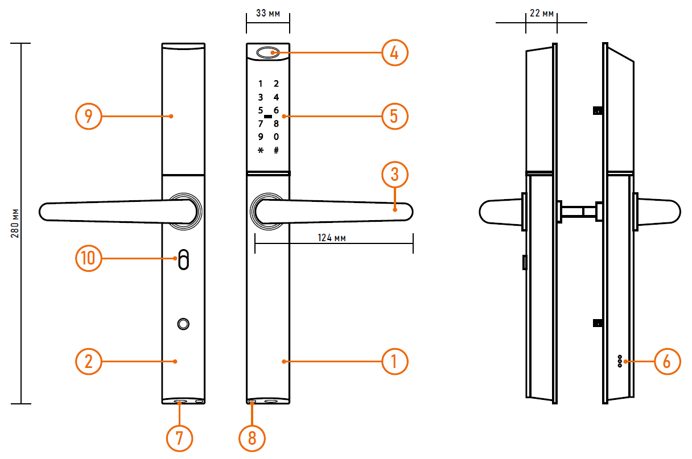

# Инструкция пользователя электронного замка Novilock Smart Shape

## ВВЕДЕНИЕ

!!! warning "ПРЕДУПРЕЖДЕНИЕ"
	Пользователь ответственен за соблюдение всех положений действующего законодательства при использовании изделия. Novicam™ не несет никакой ответственности перед лицом или организацией за ущерб или повреждения произошедшие от информации, содержащейся в данном Руководстве, а также за нарушение требований закона и иных правовых актов в процессе эксплуатации изделия.

### Меры предосторожности

- Прежде чем начать работу с устройством, внимательно ознакомьтесь с Руководством Пользователя.

- Не разбирайте устройство, это может привести к его неправильному функционированию или поломке и сделает гарантию недействительной.

- Все электрические контакты соединяйте в полном соответствии с бирками и инструкциями, указанными в данном Руководстве. В противном случае Вы можете нанести изделию непоправимый ущерб и, тем самым, также сделать гарантию недействительной.

- Не эксплуатируйте устройство в условиях, если температура, показатели влажности и технические характеристики источника питания превышают установленные значения для данного прибора.

- Не используйте для протирки изделия бензин, спирт или другие растворители, т.к. они могут повредить поверхность. Для чистки используйте мягкую сухую ткань.

### Торговые марки

Все торговые марки являются собственностью их законных владельцев.

### Авторское право

Данное Руководство и содержащаяся в нем информация защищены авторским правом. Все права защищены.

!!! success "УВАЖАЕМЫЙ ПОКУПАТЕЛЬ!"
	Поздравляем Вас с покупкой! Мы делаем все возможное, чтобы наша продукция удовлетворяла Вашим запросам. Перед началом эксплуатации изделия внимательно ознакомьтесь с Руководством пользователя и с Условиями гарантийного обслуживания.

------

## ОПИСАНИЕ

Умный замок Smart Slim производства компании Novicam™ создан чтобы обеспечить вашему объекту наивысший уровень безопасности и одновременно с этим– более комфортное и удобное открывание вашей двери. Для доступа на объект вы можете выбрать один из нескольких способов открывания: Отпечаток пальца, который позволит открыть дверь одним прикосновением; RFID карта, которую достаточно просто приложить к замку; PIN-код, введенный на кодонаборной панели; Смартфон с помощью приложения по Bluetooth (или удаленно по Wi-Fi с использованием дополнительного шлюза); Обычный ключ, в случае если все другие способы открытия для вас недоступны. Обычно используется для аварийного открытия двери. Современный дизайн устройства идеально подойдет для дверей любого стиля на любом объекте – вашей квартире, офисе, складе, апартотеле или помещений с повышенным уровнем контролем.
<figure class='table-figure'><table>
<thead>
<tr><th style='text-align:left;' >Описание</th><th style='text-align:left;' >&nbsp;</th></tr></thead>
<tbody><tr><td style='text-align:left;' >1. Передняя панель</td><td style='text-align:left;' >6. Встроенный динамик</td></tr><tr><td style='text-align:left;' >2. Задняя панель</td><td style='text-align:left;' >7. Отверстие для механического ключа</td></tr><tr><td style='text-align:left;' >3. Ручка</td><td style='text-align:left;' >8. Разъем для аварийного питания</td></tr><tr><td style='text-align:left;' >4. Сканер отпечатков</td><td style='text-align:left;' >9. отсек для батареек</td></tr><tr><td style='text-align:left;' >5. Клавиатура и считыватель карт</td><td style='text-align:left;' >10. Переключатель режима "не беспокоить"</td></tr></tbody>
</table></figure>

!!! warning "ОБРАТИТЕ  ВНИМАНИЕ"
	1. Механические ключи храните в доступном месте, в т.ч. во время установки.
	2. Заменяйте источники питания при достижении низкого уровня заряда.
	3. Внимательно изучите данное Руководство перед установкой и сохраните его для дальнейшего использования.

### НАПРЯЖЕНИЕ ПИТАНИЯ

Используйте только рекомендованное напряжение питания. Перед включением оборудования убедитесь в том, что соединительные провода (разъемы) подключены с соблюдением полярности. Неверное соединение может привести к повреждению и/или неправильному функционированию устройства.

### УСЛОВИЯ ЭКСПЛУАТАЦИИ

Не располагайте устройство в местах попадания прямых солнечных лучей. В противном случае это может привести к повреждению устройства. Строго соблюдайте установленный для данного устройства температурный режим.

#### Не устанавливайте устройство:

- в зонах с влажностью и уровнем загрязнения воздуха более 95%;
- в области повышенного испарения и парообразования или усиленной вибрации.

Храните механические ключи от замка в доступном месте.

Предотвращайте механические повреждения устройства.

<html><table cellspacing="0" cellpadding="0" class="TableNormal0" style="width:418.3pt; -aw-border-insideh:0.25pt single #000000; -aw-border-insidev:0.25pt single #000000; border-collapse:collapse"><tbody><tr style="height:16.05pt"><td style="width:141.38pt; border-top-style:solid; border-top-width:0.75pt; border-right-style:solid; border-right-width:0.75pt; border-bottom-style:solid; border-bottom-width:0.75pt; vertical-align:middle; background-color:#ececec; -aw-border-bottom:0.25pt single; -aw-border-right:0.25pt single; -aw-border-top:0.25pt single">
&nbsp;Модель
</td><td style="width:276.18pt; border-top-style:solid; border-top-width:0.75pt; border-left-style:solid; border-left-width:0.75pt; border-bottom-style:solid; border-bottom-width:0.75pt; vertical-align:middle; background-color:#ececec; -aw-border-bottom:0.25pt single; -aw-border-left:0.25pt single; -aw-border-top:0.25pt single">
&nbsp;NPL-EC16D
</td></tr><tr style="height:15.95pt"><td style="width:141.38pt; border-top-style:solid; border-top-width:0.75pt; border-right-style:solid; border-right-width:0.75pt; border-bottom-style:solid; border-bottom-width:0.75pt; vertical-align:middle; -aw-border-bottom:0.25pt single; -aw-border-right:0.25pt single; -aw-border-top:0.25pt single">
&nbsp;Версия
</td><td style="width:276.18pt; border-top-style:solid; border-top-width:0.75pt; border-left-style:solid; border-left-width:0.75pt; border-bottom-style:solid; border-bottom-width:0.75pt; vertical-align:middle; -aw-border-bottom:0.25pt single; -aw-border-left:0.25pt single; -aw-border-top:0.25pt single">
&nbsp;9016L
</td></tr><tr style="height:15.3pt"><td style="width:141.38pt; border-top-style:solid; border-top-width:0.75pt; border-right-style:solid; border-right-width:0.75pt; border-bottom-style:solid; border-bottom-width:0.75pt; vertical-align:middle; -aw-border-bottom:0.25pt single; -aw-border-right:0.25pt single; -aw-border-top:0.25pt single">
&nbsp;Считыватель
</td><td style="width:276.18pt; border-top-style:solid; border-top-width:0.75pt; border-left-style:solid; border-left-width:0.75pt; border-bottom-style:solid; border-bottom-width:0.75pt; vertical-align:middle; -aw-border-bottom:0.25pt single; -aw-border-left:0.25pt single; -aw-border-top:0.25pt single">
&nbsp;Mifare Classic (Novilock iLMS совместимый)
</td></tr><tr style="height:15.3pt"><td style="width:141.38pt; border-top-style:solid; border-top-width:0.75pt; border-right-style:solid; border-right-width:0.75pt; border-bottom-style:solid; border-bottom-width:0.75pt; vertical-align:middle; -aw-border-bottom:0.25pt single; -aw-border-right:0.25pt single; -aw-border-top:0.25pt single">
&nbsp;Количество этажей
</td><td style="width:276.18pt; border-top-style:solid; border-top-width:0.75pt; border-left-style:solid; border-left-width:0.75pt; border-bottom-style:solid; border-bottom-width:0.75pt; vertical-align:middle; -aw-border-bottom:0.25pt single; -aw-border-left:0.25pt single; -aw-border-top:0.25pt single">
&nbsp;16 с возможностью расширения
</td></tr><tr style="height:15.55pt"><td style="width:141.38pt; border-top-style:solid; border-top-width:0.75pt; border-right-style:solid; border-right-width:0.75pt; border-bottom-style:solid; border-bottom-width:0.75pt; vertical-align:middle; -aw-border-bottom:0.25pt single; -aw-border-right:0.25pt single; -aw-border-top:0.25pt single">
&nbsp;Питание
</td><td style="width:276.18pt; border-top-style:solid; border-top-width:0.75pt; border-left-style:solid; border-left-width:0.75pt; border-bottom-style:solid; border-bottom-width:0.75pt; vertical-align:middle; -aw-border-bottom:0.25pt single; -aw-border-left:0.25pt single; -aw-border-top:0.25pt single">
&nbsp;12 В внешний блок питания
</td></tr><tr style="height:15.3pt"><td style="width:141.38pt; border-top-style:solid; border-top-width:0.75pt; border-right-style:solid; border-right-width:0.75pt; border-bottom-style:solid; border-bottom-width:0.75pt; vertical-align:middle; -aw-border-bottom:0.25pt single; -aw-border-right:0.25pt single; -aw-border-top:0.25pt single">
&nbsp;Размер платы контроллера
</td><td style="width:276.18pt; border-top-style:solid; border-top-width:0.75pt; border-left-style:solid; border-left-width:0.75pt; border-bottom-style:solid; border-bottom-width:0.75pt; vertical-align:middle; -aw-border-bottom:0.25pt single; -aw-border-left:0.25pt single; -aw-border-top:0.25pt single">
&nbsp;160 x 110 мм
</td></tr><tr style="height:15.3pt"><td style="width:141.38pt; border-top-style:solid; border-top-width:0.75pt; border-right-style:solid; border-right-width:0.75pt; border-bottom-style:solid; border-bottom-width:0.75pt; vertical-align:middle; -aw-border-bottom:0.25pt single; -aw-border-right:0.25pt single; -aw-border-top:0.25pt single">
&nbsp;Размер контроллера в боксе
</td><td style="width:276.18pt; border-top-style:solid; border-top-width:0.75pt; border-left-style:solid; border-left-width:0.75pt; border-bottom-style:solid; border-bottom-width:0.75pt; vertical-align:middle; -aw-border-bottom:0.25pt single; -aw-border-left:0.25pt single; -aw-border-top:0.25pt single">
&nbsp;120 x 200 x 57 мм
</td></tr><tr style="height:15.3pt"><td style="width:141.38pt; border-top-style:solid; border-top-width:0.75pt; border-right-style:solid; border-right-width:0.75pt; border-bottom-style:solid; border-bottom-width:0.75pt; vertical-align:middle; -aw-border-bottom:0.25pt single; -aw-border-right:0.25pt single; -aw-border-top:0.25pt single">
&nbsp;Размер считывателя
</td><td style="width:276.18pt; border-top-style:solid; border-top-width:0.75pt; border-left-style:solid; border-left-width:0.75pt; border-bottom-style:solid; border-bottom-width:0.75pt; vertical-align:middle; -aw-border-bottom:0.25pt single; -aw-border-left:0.25pt single; -aw-border-top:0.25pt single">
&nbsp;62 x 50 x 8 мм
</td></tr><tr style="height:15.3pt"><td style="width:141.38pt; border-top-style:solid; border-top-width:0.75pt; border-right-style:solid; border-right-width:0.75pt; border-bottom-style:solid; border-bottom-width:0.75pt; vertical-align:middle; -aw-border-bottom:0.25pt single; -aw-border-right:0.25pt single; -aw-border-top:0.25pt single">
&nbsp;Монтаж считывателя
</td><td style="width:276.18pt; border-top-style:solid; border-top-width:0.75pt; border-left-style:solid; border-left-width:0.75pt; border-bottom-style:solid; border-bottom-width:0.75pt; vertical-align:middle; -aw-border-bottom:0.25pt single; -aw-border-left:0.25pt single; -aw-border-top:0.25pt single">
&nbsp;Накладной
</td></tr><tr style="height:15.3pt"><td style="width:141.38pt; border-top-style:solid; border-top-width:0.75pt; border-right-style:solid; border-right-width:0.75pt; border-bottom-style:solid; border-bottom-width:0.75pt; vertical-align:middle; -aw-border-bottom:0.25pt single; -aw-border-right:0.25pt single; -aw-border-top:0.25pt single">
&nbsp;Класс защиты
</td><td style="width:276.18pt; border-top-style:solid; border-top-width:0.75pt; border-left-style:solid; border-left-width:0.75pt; border-bottom-style:solid; border-bottom-width:0.75pt; vertical-align:middle; -aw-border-bottom:0.25pt single; -aw-border-left:0.25pt single; -aw-border-top:0.25pt single">
&nbsp;Пылевлагозащита IP55
</td></tr><tr style="height:15.3pt"><td style="width:141.38pt; border-top-style:solid; border-top-width:0.75pt; border-right-style:solid; border-right-width:0.75pt; border-bottom-style:solid; border-bottom-width:0.75pt; vertical-align:middle; -aw-border-bottom:0.25pt single; -aw-border-right:0.25pt single; -aw-border-top:0.25pt single">
&nbsp;Рабочая температура
</td><td style="width:276.18pt; border-top-style:solid; border-top-width:0.75pt; border-left-style:solid; border-left-width:0.75pt; border-bottom-style:solid; border-bottom-width:0.75pt; vertical-align:middle; -aw-border-bottom:0.25pt single; -aw-border-left:0.25pt single; -aw-border-top:0.25pt single">
&nbsp;-20 ~ 70 °C
</td></tr><tr style="height:15.3pt"><td style="width:141.38pt; border-top-style:solid; border-top-width:0.75pt; border-right-style:solid; border-right-width:0.75pt; border-bottom-style:solid; border-bottom-width:0.75pt; vertical-align:middle; -aw-border-bottom:0.25pt single; -aw-border-right:0.25pt single; -aw-border-top:0.25pt single">
&nbsp;Рабочая влажность
</td><td style="width:276.18pt; border-top-style:solid; border-top-width:0.75pt; border-left-style:solid; border-left-width:0.75pt; border-bottom-style:solid; border-bottom-width:0.75pt; vertical-align:middle; -aw-border-bottom:0.25pt single; -aw-border-left:0.25pt single; -aw-border-top:0.25pt single">
&nbsp;5 ~ 95 %
</td></tr></tbody></table></html>